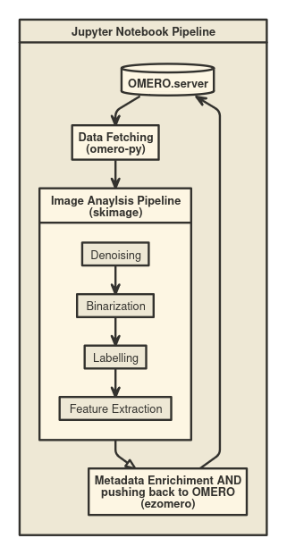

# OMERO Workshop - ezomero and napari-omero Introduction

This page contains the resources for the lecture "ezomero and napari-omero Introduction" in the OMERO workshop 2025, which takes place in B CUBE, Dresden, Germany.

This work is licensed by the Bio-Image Analysis Technology Development group (BiAPoL), Cluster of Excellence Physics of Life (PoL), Dresden, under a Creative Commons Attribution 4.0 International License.

## Overview

This workshop will introduce participants to the use mainly of the [ezomero](https://github.com/erickmartins/ezomero) and [napari-omero](https://github.com/tlambert03/napari-omero) libraries for working with OMERO data in a napari environment. Participants will learn how to set up their environment, load images from OMERO, and perform basic image processing tasks. Here is an overview of the ezomero workflow:



## Prerequisites and Installation

### 1. Download or clone this repository to your local machine.

  - Click the green "Code" button and then "Download ZIP"
  - Unzip the downloaded file to a folder of your choice (remember where you saved it!)

### 2. Download and install [Miniforge](https://conda-forge.org/download/)

### 3. Create a new conda environment and install the dependencies

 - Find and open the Miniforge Prompt
 - Create a new conda environment and install the dependencies by typing the commands below. Please type one command at a time and hit ENTER. Please be patient as it may take some minutes. If asked to proceed, type y and hit ENTER again:
    - Single environment for both [ezomero](https://github.com/erickmartins/ezomero?tab=readme-ov-file#ezomero) and [napari-omero](https://github.com/tlambert03/napari-omero?tab=readme-ov-file#napari-omero):
        ```bash
        conda create -y -n napari-omero-ez python=3.11
        conda activate napari-omero-ez
        conda install -c conda-forge -c bioconda napari-omero pyqt ezomero jupyterlab cmap omero-py>=5.17.0
        pip install napari-skimage
        ```
        If the above commands do not work, please create 2 separate environments, one for ezomero and one for napari-omero.
    - *Optional*: Environment for ezomero (only):
        ```bash
        conda create -n ezomero python=3.10
        conda activate ezomero
        conda install jupyterlab cmap
        pip install https://github.com/glencoesoftware/zeroc-ice-py-linux-x86_64/releases/download/20240202/zeroc_ice-3.6.5-cp310-cp310-manylinux_2_28_x86_64.whl
        pip install ezomero
        ```
    - *Optional*: Environment for napari-omero (only):
        ```bash
        conda create -n napari-omero python=3.10
        conda activate napari-omero
        conda install -c conda-forge napari-omero pyqt
        pip install napari-skimage
        ```

### 4. Test if the installations were successful
- Test if napari-omero is working by activating the environemnt:
    ```bash
    conda activate napari-omero-ez
    ```
    or (if you created separate environments)
    ```bash
    conda activate napari-omero
    ```
    Then open napari:
    ```bash
    napari
    ```
    and checking if the napari window opens. Then, in the Plugins menu, go to "napari-omero -> OMERO Browser" and check if a login window appears on the right side of the napari window.

- Test if ezomero is working by activating the environemnt:
    ```bash
    conda activate napari-omero-ez
    ```
    or (if you created separate environments)
    ```bash
    conda activate ezomero
    ```
    Then open jupyter lab:
    ```bash
    jupyter lab
    ```
    and checking if the jupyter lab window opens in your browser. Then, on the left side, navigate to the folder where you unzipped this repository and open the notebook `ezomero_exercise.ipynb`. Run the first cell (click on the cell and hit SHIFT + ENTER) and check if it runs without errors.


## Example Data

We used a sub-set of the BBBC014v1 set provided by Ilya Ravkin, available from the Broad Bioimage Benchmark Collection [Ljosa et al., Nature Methods, 2012]. For details and biological background see https://www.broadinstitute.org/bbbc/BBBC014/. The data can be found in the workshop OMERO server under the "workshop_2025" and the user "Marcelo Leomil Zoccoler", or in this repository in data/BBBC014v1_subset.zip. Feel free to upload it to your user in OMERO or upload your own data.

## Exercises

The main exercise focuses on a notebook using ezomero, as it offers a wider range of OMERO functionalities. The image analysis steps with scikit-image are included to illustrate a typical workflow, but are not the core of the exercise—the goal is to use ezomero to retrieve and post images and annotations to OMERO. Please open the notebook `notebooks/ezomero_exercise.ipynb` and follow the instructions there.

A brief demonstration of napari-omero is provided separately in a markdown file. The demonstration can be found in `napari_omero_demo.md` in the folder `napari_omero_demo`. It includes instructions on how to load images from OMERO using napari-omero and perform some basic image processing tasks with [napari-skimage](https://github.com/guiwitz/napari-skimage).

## Acknowledgements

We would like to acknowledge Johannes Soltwedel (German BioImaging) and Riccardo Massei (UFZ - Leipzig) for previous contributions to the materials presented here, and Cornelia Wetzker (NFDI4BIOIMAGE) for her support with the OMERO server. This project was supported by the Deutsche Forschungsgemeinschaft under Germany’s Excellence Strategy – EXC2068 - Cluster of Excellence “Physics of Life” of TU Dresden.
