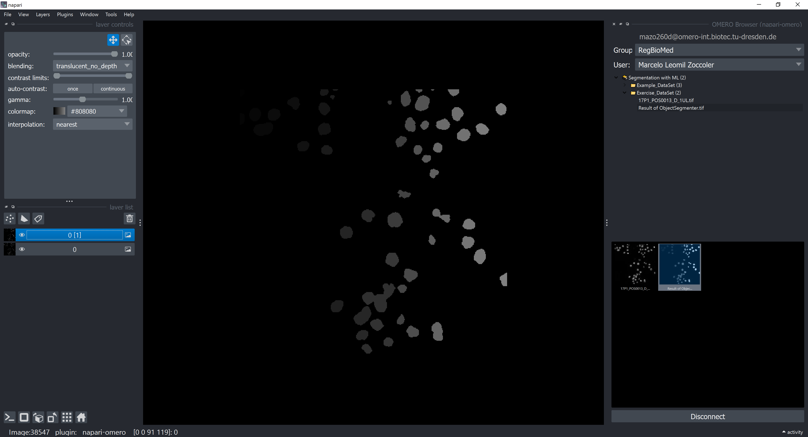
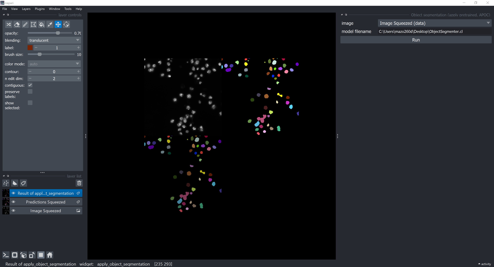

# Reproducing a Segmentation Workflow Created with napari-apoc and OMERO

In order to reproduce a simple single-image segmentation workflow, you need access to the following:
- the original image data
- the Machine Learning (ML) model
- the previous segmentation results (predictions), for comparison

Optionally, for completness, you may also want to have access to the  annotations (ground truth) used to train the ML model.

We have shown in the [previous section](https://biapol.github.io/AMHCT_Bio_Image_Analysis_2025/napari_apoc_omero_workflow/workflow_creation.html) how to store the original image data, the predictions and the ML model in OMERO. In this section, we will show how load the data from OMERO and reproduce the segmentation task using the napari-apoc plugin.

## Loading images from OMERO

For small images, you could download them directly via the Download button in OMERO Insight. For example, clicking on the download button on the top right corner:

```{image} ./R_apoc_omero_27.png
:alt: Download model
:width: 400px
:align: center
```

### Loading images from OMERO with napari-omero

 However, for larger images and to retrieve metadata, it is better to use the napari-omero plugin to load the images directly into napari.

Thus, activate the environment again and start napari:

```{image} ./apoc_omero_4.png
:alt: napari
:width: 300px
:align: center
```

Open the OMERO Browser panel (`Plugins > napari-omero > OMERO Browser`), log in with your ZIH credentials to the server address `omero-int.biotec.tu-dresden.de` again and load both the original image and the predictions to the napari canvas.



### Handling the Image Dimensions

Rename the image layers by double-clicking on the layer names in the napari layer list.

Remove the unitary dimensions from the original image layers (`Tools > Transforms > Remove axes of length 1`), and duplicate the resulting layer by right-clicking on the layer name in the layer list and selecting "Duplicate Layer".

```{image} ./R_apoc_omero_29.png	
:alt: Remove axes of lenght 1
:width: 400px
:align: center
```

Rename the duplicated layer (e.g "Result od squeeze" -> "Image Squeezed"). Do the same for the predictions layer. You should end up with something like this:

```{image} ./R_apoc_omero_31.png
:alt: Rename layers
:width: 300px
:align: center
```

Finally, remove the original image layers (the ones with unitary dimensions) by selecting them and clicking on the trash can icon on the top right corner of the layer list. Convert the predictions layer to a `Labels` layer by right-clicking on the layer name in the layer list and selecting "Convert to Labels".

```{image} ./R_apoc_omero_32.png
:alt: Convert to Labels
:width: 400px
:align: center
```

## Loading the ML model

We have previously stored the ML model in OMERO as an attachment to the image. To download the model, in OMERO, select the image and, in the "Attachments" tab, click on the model file and choose "Download" from the menu. This will download the model file to your local machine.

```{image} ./R_apoc_omero_26.png
:alt: Download model
:width: 300px
:align: center
```

## Running Pre-trained Object Segmentation Model with napari-apoc

Now, we can run the pre-trained object segmentation model on the image. To do this, go to `Tools > Segmentation/labeling > Object Segmentation (apply pretrained, APOC)` in the menu bar.

```{image} ./R_apoc_omero_33.png
:alt: APOC
:width: 400px
:align: center
```

Select the image layer (e.g. "Image Squeezed") and the model file you downloaded from OMERO. Click on "Run" to run the predictions. You should see the predictions as a new `Lables` layer in napari.



## Comparing the predictions with the previous segmentation results

To compare the new predictions with the previous segmentation, you can use [The Segmentation Game](https://github.com/haesleinhuepf/the-segmentation-game) plugin. It calculates useful metrics to compare the predictions with the ground truth. 

Go to `Plugins > The Segmentation Game Widget` in the menu bar.

```{image} ./R_apoc_omero_35.png
:alt: Segmentation game
:width: 400px
:align: center
```

This will open the Segmentation Game widget. Select the ground truth layer (e.g. "Predictions Squeezed") and the predictions layer (e.g. "Result of apply_object_segmentation"). Click on "Run" to calculate the chosen metric. In the example below, we used the "Jaccard Index sparse", which is a measure of similarity between two sets, and it is defined as the size of the intersection divided by the size of the union of the two sets.

```{image} ./R_apoc_omero_36.png
:alt: Segmentation game
:width: 400px
:align: center
```

A value 1 means perfect agreement, while a value 0 means no agreement.

## Conclusion

In this section, we have shown how to reproduce a segmentation workflow using the napari-apoc plugin and OMERO. We loaded the original image and the predictions from OMERO, removed the unitary dimensions from the image layers, and ran the pre-trained object segmentation model on the image. Finally, we compared the predictions with the previous segmentation results using The Segmentation Game plugin.