# Segmenting nuclei using napari-omero and napari-skimage

## Activating the environment

Open a terminal (preferably Miniforge Prompt) and run the following command to activate the environment:

```bash
conda activate napari-omero-ez
```
or (if you created separate environments)
```bash
conda activate napari-omero
```

And start napari:

```bash
napari
```

## Loading images from OMERO with napari-omero

In the napari window, go to the menu bar and select `Plugins > napari-omero > OMERO Browser`.

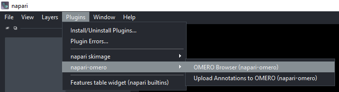


This will open the OMERO Browser panel on the right side of the napari window. Enter your ZIH credentials and the server address in the OMERO Browser panel. Click on "Connect".

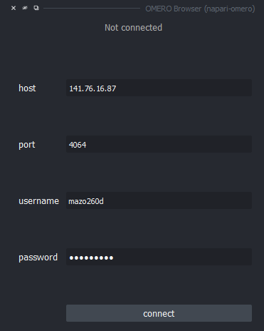

Once you are connected, change the "Group" to "workshop_2025" and set the "User" to "Marcelo Leomil Zoccoler". This will give you access to the images shown here. You should see the Project "ezomero_and_napari_omero_basics". Expand the Project tree and the "BBBC014_subset" tree. Click on the image to load it to the napari canvas.

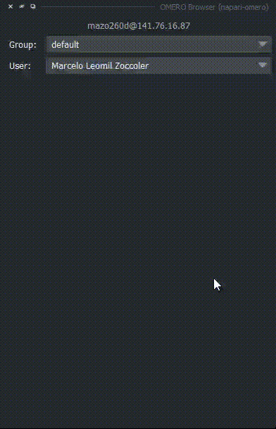

You can close the OMERO Browser panel by clicking on the "X" button on the top left corner of the panel. 

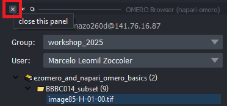


## Handling the Image Dimensions with napari-skimage

OMERO always stores images as 5D arrays (X, Y, Z, C, T). Therefore, even if you load a single-channel 2D image, it will be loaded as a 5D array with the dimensions (1, 1, 1, Y, X). But since napari splits channels into different layers, you actually end up with dimensions (1, 1, Y, X) for the image.

You can check the dimensions of the image by clicking on `Layers > Transform > Axis operations` in the menu bar. 

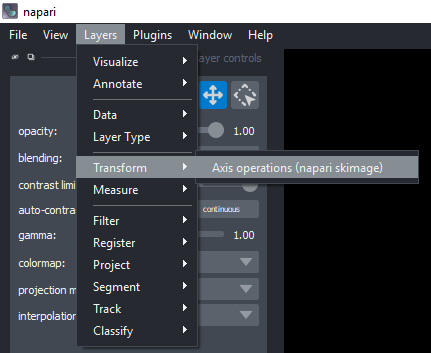

This will open a panel with information about the selected layer and some operations to apply. Choose squeeze and click on "Apply operation".

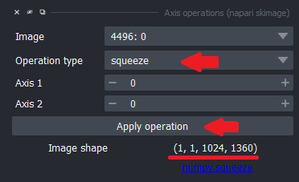


Check the dimensions of the image again by choosing the new layer. You should see that the dimensions of the image are now only (Y, X).

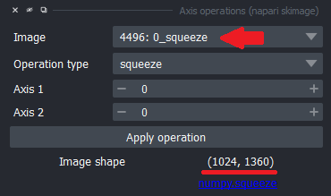

Close the widget.

## Image Processing with napari-skimage

Now, you can apply some image processing operations using napari-skimage. For example, you can apply a Gaussian filter to smooth the image. Go to `Layers > Filters > Filtering > Gaussian filter...` in the menu bar.

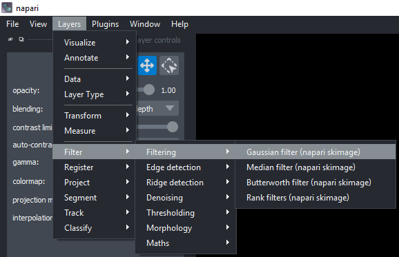

On the new widget, select the squeezed layer and set the sigma value to 2. Click on "Apply Gaussian Filter".

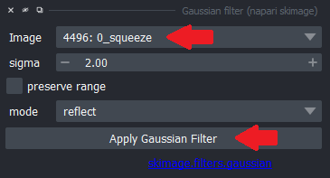

You should see a new layer with the smoothed image.

Now, you can apply a threshold to segment the nuclei. Go to `Layers > Filter > Thresholding > Automated Threshold` in the menu bar.

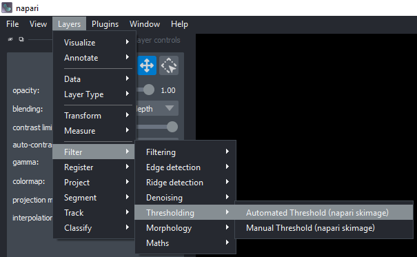

On the new widget, select the smoothed layer and choose "otsu" as the method. Click on "Apply Thresholding".

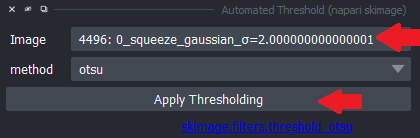

You should see a new layer with the binary mask of the nuclei.

You can perform instance segmentation using the "Label" function. Go to `Layers > Segment > Label connected components` in the menu bar.

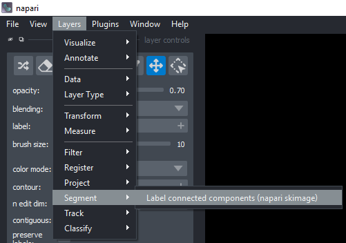

On the new widget, select the binary mask layer and click on "Label connected components".

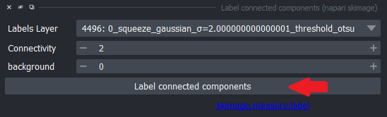

You should see a new layer with the labeled nuclei.

Finally, you can measure some properties of the labeled nuclei. Go to `Layers > Measure > Regionprops` in the menu bar.

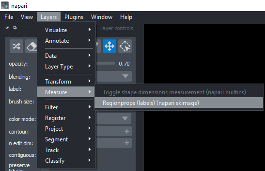

On the new widget, select the labeled layer, hold CTRL/CMD and click on a few properties, and click on "Analyze".


You should see a new table with the properties of the labeled nuclei.

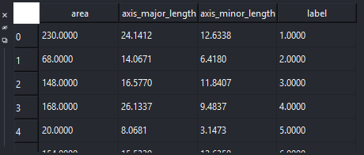

You can save the table as a CSV file by clicking on the "Save Results" button below the "Analyze" button.

## Saving Layers

To save napari layers locally, select the layer you want to save, then go to `File > Save Selected Layers...`.

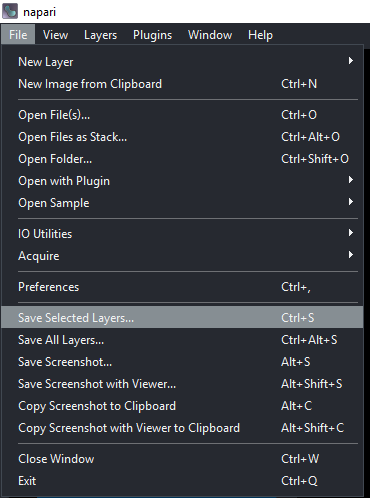

## Uploading Results back to OMERO

You can upload the saved layers back to OMERO using the [OMERO Insight application](https://omero-guides.readthedocs.io/en/latest/upload/docs/import-desktop-client.html), the [OMERO command line interface (CLI)](https://omero-guides.readthedocs.io/en/latest/upload/docs/import-cli.html) or [ezomero](https://ezomero.readthedocs.io/en/latest/).